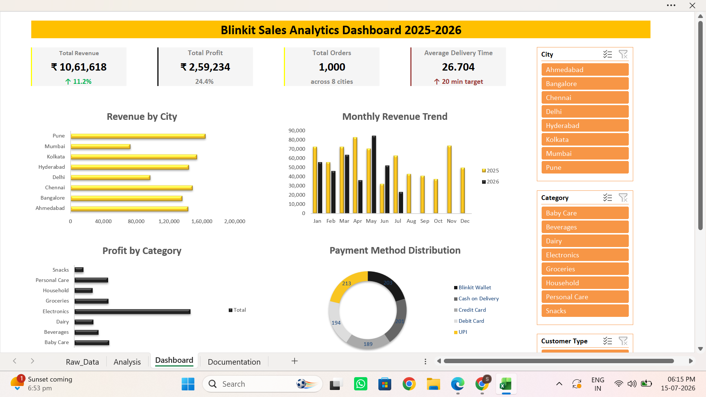
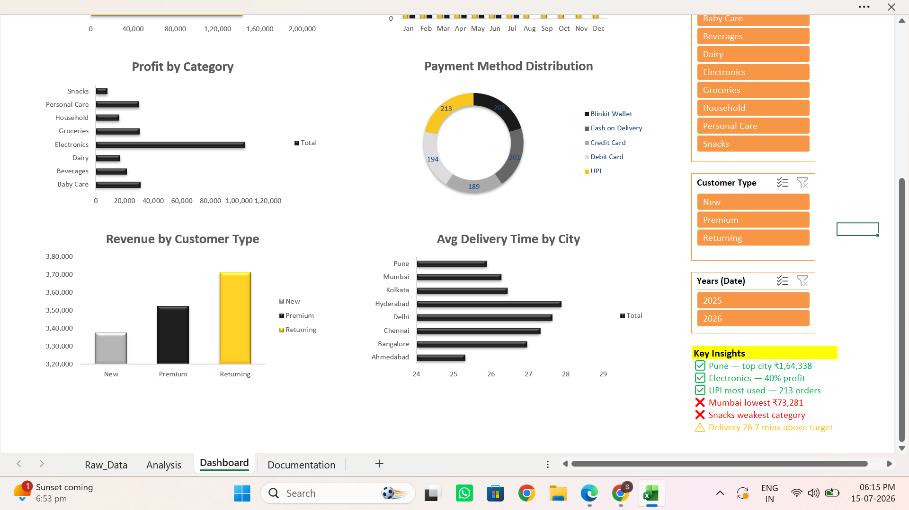

# 🟡 Blinkit Sales Analytics Dashboard

## Project Overview
An interactive Excel dashboard analyzing 1000 Blinkit orders across 8 Indian cities from January 2025 to July 2026.

## Dashboard Preview

## Business Questions Answered
- Which city generates highest revenue?
- Which category is most profitable?
- Which payment method is most preferred?
- How has revenue trended month by month?
- Which products are top performers?
- Which city delivers fastest?

## Key Insights
- Pune is the top revenue city — ₹1,64,338
- Electronics contributes 40% of total profit
- UPI is the most preferred payment method (213 orders)
- Mumbai needs attention — lowest revenue at ₹73,281
- Delivery time at 26.7 mins is above the 20 min target

## Dataset
- 1000 orders
- 14 columns
- 8 Indian cities
- 30 products
- 8 categories
- Date range: Jan 2025 — Jul 2026

## Tools Used
- Microsoft Excel
- Pivot Tables
- PivotCharts
- Slicers
- Dynamic Formulas

## Skills Demonstrated
- Data Cleaning
- Data Analysis
- Dashboard Design
- Business Insights
- Excel Formulas

## Author
Battu Srinath Reddy
B.Tech Computer Science (AI/ML) — Hyderabad
